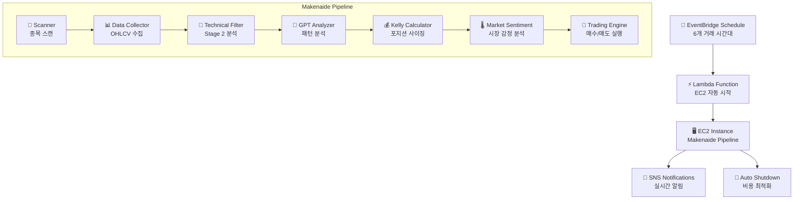

# 🚀 Makenaide - 완전 자동화 암호화폐 거래 시스템

> **EventBridge → Lambda → EC2 → 자동매매 → 자동종료**
> 글로벌 거래 시간대 기반 완전 자동화 암호화폐 매매 봇


## 🎯 시스템 개요

Makenaide는 **Weinstein Stage 2 이론**, **VCP 패턴**, **Kelly 공식**을 기반으로 한 완전 자동화 암호화폐 거래 시스템입니다. AWS 서비스를 활용하여 글로벌 거래 시간대에 맞춰 자동으로 실행되며, 비용 최적화를 위해 거래 완료 후 자동 종료됩니다.

### ✨ 핵심 특징

- 🌍 **글로벌 거래 시간대 대응**: 아시아/유럽/미국 시장 활성화 시간 최적화
- 🤖 **완전 자동화**: EventBridge 스케줄러 → Lambda → EC2 자동 시작/종료
- 📊 **실시간 SNS 알림**: 발굴 종목, 거래 결과, 시스템 상태 실시간 알림
- 💰 **비용 최적화**: 실행 시간만큼만 과금 (월 $9.45 운영비)
- 🛡️ **리스크 관리**: Kelly 공식 기반 포지션 사이징, BEAR 시장 자동 차단

## 🏗️ 시스템 아키텍처



## 📅 자동 실행 스케줄 (KST)

| 시간 | 시장 타이밍 | 특징 |
|------|-------------|------|
| **02:00** | 아시아 심야 + 유럽 저녁 | 유동성 높음 |
| **09:00** | 한국/일본 장 시작 + 미국 동부 밤 | 아시아 메인 세션 |
| **15:00** | 아시아 오후 + 유럽 오전 시작 | 글로벌 오버랩 |
| **18:00** | 한국 퇴근시간 + 유럽 점심 활성화 | 거래량 증가 |
| **21:00** | 아시아 저녁 골든타임 + 유럽 오후 | 최고 활성화 |
| **23:00** | 아시아 밤 + 미국 동부 오전 시작 | 미국 진입 |

## 🚀 빠른 시작

### 1. 환경 설정

```bash
# 저장소 클론
git clone https://github.com/yourusername/makenaide.git
cd makenaide

# 환경 변수 설정
cp .env.example .env
# .env 파일에서 API 키 설정

# 의존성 설치
pip install -r requirements.txt
```

### 2. AWS 인프라 배포

```bash
# 전체 자동화 시스템 배포
python3 deploy_complete_automation.py

# 개별 컴포넌트 배포
python3 deploy_lambda_ec2_starter.py      # Lambda 함수
python3 setup_eventbridge_schedule.py     # EventBridge 스케줄
python3 setup_ec2_autostart.py            # EC2 자동 실행
python3 setup_sns_topics.py               # SNS 알림 시스템
```

### 3. 수동 실행 (테스트)

```bash
# 전체 파이프라인 실행
python3 makenaide.py --risk-level moderate

# Dry Run (실제 거래 없이 테스트)
python3 makenaide.py --dry-run --no-gpt
```

## 📊 투자 전략

### 🎯 Weinstein Stage 2 돌파 전략
- **Stage 1**: 기반 구축 단계 (횡보)
- **Stage 2**: 상승 돌파 단계 ⭐ **매수 타이밍**
- **Stage 3**: 분배 단계 (고점 횡보)
- **Stage 4**: 하락 단계

### 🔍 VCP (Volatility Contraction Pattern)
- GPT-4 기반 차트 패턴 분석
- 변동성 수축 후 폭발적 상승 포착
- 미너비니 25% 법칙 적용

### 💰 Kelly 공식 포지션 사이징
- 패턴별 승률 매핑 (Stage 2: 65-70%)
- 동적 포지션 조정
- 리스크 기반 할당 비율 계산

## 📧 SNS 알림 시스템

### 거래 알림 (makenaide-trading-alerts)
- 🎯 발굴 종목 리스트 (실시간 가격 포함)
- 💸 매수/매도 거래 결과
- 📊 포트폴리오 현황 및 손익

### 시스템 알림 (makenaide-system-alerts)
- 🚀 EC2 자동 시작/종료 상태
- 🔧 파이프라인 실행 결과
- 🚨 오류 및 긴급 상황

## 🗂️ 프로젝트 구조

```
makenaide/
├── 🎯 makenaide.py                 # 메인 오케스트레이터
├── 📡 scanner.py                   # 업비트 종목 스캔
├── 📊 data_collector.py            # OHLCV 데이터 수집
├── 🎯 hybrid_technical_filter.py   # Weinstein Stage 2 분석
├── 🤖 gpt_analyzer.py              # GPT-4 패턴 분석
├── 💰 kelly_calculator.py          # Kelly 포지션 사이징
├── 🌡️ market_sentiment.py         # 시장 감정 분석
├── 💸 trading_engine.py            # 매수/매도 실행
├── 📧 sns_notification_system.py   # SNS 알림 시스템
├── 🗄️ db_manager_sqlite.py         # SQLite 데이터베이스 관리
├── 🔧 utils.py                     # 공통 유틸리티
│
├── 🚀 AWS 자동화 스크립트
├── ⚡ lambda_ec2_starter.py        # Lambda EC2 시작 함수
├── 📅 setup_eventbridge_schedule.py # EventBridge 스케줄 설정
├── 🖥️ setup_ec2_autostart.py       # EC2 자동 실행 설정
├── 📧 setup_sns_topics.py          # SNS 토픽 설정
├── 🔧 deploy_complete_automation.py # 전체 시스템 배포
│
├── 📋 설정 및 문서
├── 📝 CLAUDE.md                    # 프로젝트 가이드라인
├── 🗺️ makenaide_local.mmd          # 아키텍처 다이어그램
├── 🗺️ sns_notification_architecture.mmd # SNS 알림 구조
├── ⚙️ .env                         # 환경 변수 설정
└── 📦 requirements.txt             # Python 의존성
```

## 🛠️ 개발 및 배포

### 로컬 개발
```bash
# 개발 환경 설정
python3 -m venv venv
source venv/bin/activate
pip install -r requirements.txt

# 데이터베이스 초기화
python3 -c "from db_manager_sqlite import *; init_database()"

# 개별 모듈 테스트
python3 scanner.py                  # 종목 스캔 테스트
python3 data_collector.py           # 데이터 수집 테스트
python3 hybrid_technical_filter.py  # 기술적 분석 테스트
```

### EC2 배포
```bash
# EC2에 코드 업로드
scp -i your-key.pem *.py ec2-user@your-ec2:/home/ec2-user/makenaide/

# EC2에서 환경 설정
ssh -i your-key.pem ec2-user@your-ec2
cd makenaide
python3 setup_ec2_autostart.py
```

## 📊 모니터링 및 로그

### CloudWatch 로그
- **Lambda**: `/aws/lambda/makenaide-ec2-starter`
- **EC2**: `~/makenaide/logs/auto_execution.log`

### 성과 메트릭
- 승률, 수익률, 손익비
- 거래 빈도 및 포지션 크기
- 시장 대비 성과 (Alpha, Beta)

### 알림 설정
```bash
# SNS 토픽 구독
python3 setup_sns_topics.py
# 이메일 확인 후 구독 승인 필요
```

## 💰 비용 구조

| 서비스 | 사용량 | 월 비용 |
|--------|--------|---------||
| **EC2** | t3.medium (5.25시간/일) | $6.55 |
| **Lambda** | 180회 실행/월 | $0.00 |
| **EventBridge** | 180회 규칙/월 | $0.00 |
| **SNS** | 500 알림/월 | $0.50 |
| **EBS** | 30GB gp3 SSD | $2.40 |
| **총 합계** | - | **약 $9.45/월** |

## 🚨 리스크 및 면책사항

⚠️ **투자 위험 고지**
- 암호화폐 투자는 원금 손실 위험이 있습니다
- 과거 성과가 미래 수익을 보장하지 않습니다
- 투자 전 충분한 이해와 위험 평가가 필요합니다
- 본 시스템은 교육 및 연구 목적으로 제공됩니다

📝 **사용자 책임**
- 실제 투자 시 사용자 본인의 판단과 책임 하에 진행
- API 키 및 개인정보 보안 관리
- 법적 규제 및 세금 신고 의무 준수

## 📄 라이선스

MIT License - 자세한 내용은 [LICENSE](LICENSE) 파일 참조

## 🤝 기여하기

1. Fork the Project
2. Create your Feature Branch (`git checkout -b feature/AmazingFeature`)
3. Commit your Changes (`git commit -m 'Add some AmazingFeature'`)
4. Push to the Branch (`git push origin feature/AmazingFeature`)
5. Open a Pull Request

## 📞 지원 및 문의

- 📧 이메일: support@makenaide.com
- 🐛 이슈 리포트: [GitHub Issues](https://github.com/yourusername/makenaide/issues)
- 📖 문서: [프로젝트 Wiki](https://github.com/yourusername/makenaide/wiki)

---

**⚡ 24/7 글로벌 시장 기회를 놓치지 마세요!**
*Makenaide로 완전 자동화된 암호화폐 거래를 시작하세요.* 🚀