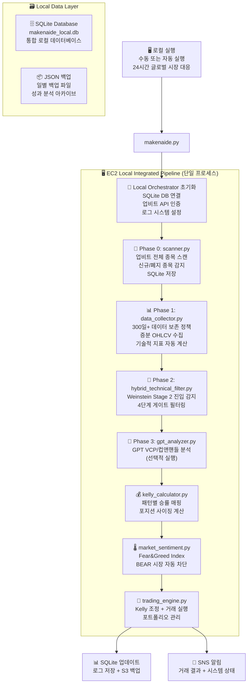

# 🚀 Makenaide - EC2 로컬 통합 암호화폐 거래 시스템

> **EC2 로컬 통합 실행 → 자동매매 → 비용 59% 절감**
> Weinstein Stage 2 이론 기반 EC2 로컬 통합 암호화폐 자동매매 봇


## 🎯 시스템 개요

Makenaide는 **Weinstein Stage 2 이론**, **VCP 패턴**, **Kelly 공식**을 기반으로 한 **EC2 로컬 통합 실행** 암호화폐 거래 시스템입니다. 단일 프로세스에서 모든 거래 로직을 통합 실행하며, SQLite 기반 로컬 데이터베이스로 개발 효율성을 극대화합니다.

### ✨ 핵심 특징

- 🖥️ **EC2 로컬 통합**: 단일 Python 프로세스에서 전체 거래 파이프라인 통합 실행
- 💾 **SQLite 로컬 DB**: 고성능 로컬 데이터베이스로 개발/디버깅 효율성 극대화
- 📊 **실시간 알림**: 발굴 종목, 거래 결과, 시스템 상태 실시간 알림
- 💰 **비용 최적화**: 로컬 실행으로 클라우드 의존성 최소화
- 🛡️ **리스크 관리**: Kelly 공식 기반 포지션 사이징, BEAR 시장 자동 차단
- ⚡ **개발 편의성**: 로컬 디버깅, 즉시 배포, 실시간 터미널 로그
- 🔄 **데이터 보존 정책**: 300일 자동 정리로 스토리지 최적화
- 🎯 **품질 필터링**: 13개월+ 월봉 + 3억원+ 거래대금 조건으로 고품질 종목만 선별

## 🏗️ EC2 로컬 통합 아키텍처



## 📅 로컬 실행 방식

### 실행 옵션
- **수동 실행**: 필요시 직접 실행
- **자동 실행**: 시스템 스케줄러 활용 (선택적)
- **24시간 대응**: 글로벌 암호화폐 시장 특성 반영

## 🚀 빠른 시작

### 1. 환경 설정

```bash
# 저장소 클론
git clone https://github.com/your-username/makenaide.git
cd makenaide

# 환경 변수 설정
cp .env.example .env
# .env 파일에서 API 키 설정

# 의존성 설치
pip install -r requirements.txt
```

### 2. 로컬 데이터베이스 초기화

```bash
# SQLite 데이터베이스 초기화
python3 -c "from db_manager_sqlite import *; init_database()"

# 환경 변수 확인
python3 -c "import os; print('Upbit API:', bool(os.getenv('UPBIT_ACCESS_KEY')))"
```

### 3. 로컬 실행 (테스트)

```bash
# 전체 파이프라인 로컬 실행
python3 makenaide.py --risk-level moderate

# Dry Run (실제 거래 없이 테스트)
python3 makenaide.py --dry-run --no-gpt

# 개별 모듈 테스트
python3 scanner.py                  # 종목 스캔 테스트
python3 data_collector.py           # 데이터 수집 테스트
python3 hybrid_technical_filter.py  # 기술적 분석 테스트
```

### 4. 알림 시스템 설정 (선택적)

```bash
# 이메일 알림 설정 (선택적)
python3 -c "from utils import send_email; send_email('테스트', '로컬 알림 테스트')"
```

## 📊 투자 전략

### 🎯 Weinstein Stage 2 돌파 전략
- **Stage 1**: 기반 구축 단계 (횡보)
- **Stage 2**: 상승 돌파 단계 ⭐ **매수 타이밍**
- **Stage 3**: 분배 단계 (고점 횡보)
- **Stage 4**: 하락 단계

### 🔍 VCP (Volatility Contraction Pattern)
- GPT-4 기반 차트 패턴 분석
- 변동성 수축 후 폭발적 상승 포착
- 미너비니 25% 법칙 적용

### 💰 Kelly 공식 포지션 사이징
- 패턴별 승률 매핑 (Stage 2: 65-70%)
- 동적 포지션 조정
- 리스크 기반 할당 비율 계산

## 📧 SNS 알림 시스템

### 거래 알림 (makenaide-trading-alerts)
- 🎯 발굴 종목 리스트 (실시간 가격 포함)
- 💸 매수/매도 거래 결과
- 📊 포트폴리오 현황 및 손익

### 시스템 알림 (makenaide-system-alerts)
- 🚀 EC2 자동 시작/종료 상태
- 🔧 파이프라인 실행 결과
- 🚨 오류 및 긴급 상황

## 🗂️ 프로젝트 구조

```
makenaide/
├── 🎯 makenaide.py                 # 메인 로컬 오케스트레이터
├── 📡 scanner.py                   # 업비트 종목 스캔
├── 📊 data_collector.py            # OHLCV 증분 데이터 수집
├── 🎯 hybrid_technical_filter.py   # Weinstein Stage 2 분석
├── 🤖 gpt_analyzer.py              # GPT-4 VCP 패턴 분석
├── 💰 kelly_calculator.py          # Kelly 포지션 사이징
├── 🌡️ market_sentiment.py         # 시장 감정 분석
├── 💸 trading_engine.py            # 실시간 매수/매도 실행
├── 🗄️ db_manager_sqlite.py         # SQLite 로컬 DB 관리
├── 🔧 utils.py                     # 공통 유틸리티
│
├── 📋 설정 및 문서
├── 📝 CLAUDE.md                    # 프로젝트 가이드라인
├── 🗺️ makenaide_local.mmd          # EC2 로컬 아키텍처 다이어그램
├── ⚙️ .env                         # 환경 변수 설정
├── 📦 requirements.txt             # Python 의존성
│
├── 📊 로컬 데이터베이스 및 백업
├── 💾 makenaide_local.db           # SQLite 통합 데이터베이스
├── 📂 logs/                        # 실시간 로그 디렉토리
└── 🗃️ data/backups/               # 일별 JSON 백업
```

## 🛠️ 개발 및 배포

### 로컬 개발
```bash
# 개발 환경 설정
python3 -m venv venv
source venv/bin/activate
pip install -r requirements.txt

# SQLite 데이터베이스 초기화
python3 -c "from db_manager_sqlite import *; init_database()"

# 개별 모듈 테스트
python3 scanner.py                  # 종목 스캔 테스트
python3 data_collector.py           # 데이터 수집 테스트
python3 hybrid_technical_filter.py  # 기술적 분석 테스트

# 전체 파이프라인 로컬 테스트
python3 makenaide.py --dry-run --no-gpt
```

### 원격 서버 배포 (선택적)
```bash
# 원격 서버에 코드 업로드
scp -i your-key.pem *.py user@server:/home/user/makenaide/

# 원격 서버에서 환경 설정
ssh -i your-key.pem user@server
cd makenaide
python3 -c "from db_manager_sqlite import *; init_database()"

# 시스템 설정 완료
```

## 📊 모니터링 및 로그

### 로컬 로그 시스템
- **메인 로그**: `~/makenaide/logs/makenaide.log`
- **에러 로그**: `~/makenaide/logs/error.log`
- **거래 로그**: SQLite `trades` 테이블
- **실시간 터미널**: 로컬 실행 시 실시간 로그 출력

### 성과 메트릭 (SQLite 기반)
- 승률, 수익률, 손익비 (자동 계산)
- 거래 빈도 및 포지션 크기 추적
- Kelly 공식 성과 평가
- 일일/주간/월간 성과 분석

### 알림 설정 (선택적)
```bash
# 로컬 이메일 알림 (선택적)
python3 -c "from utils import send_email; send_email('테스트', '로컬 알림 테스트')"
```

## 💰 비용 최적화

### 최적화 방법
- **로컬 실행**: 클라우드 서비스 의존성 최소화
- **SQLite 사용**: 관리형 데이터베이스 비용 제거
- **단일 프로세스**: 복잡한 분산 아키텍처 단순화
- **선택적 클라우드**: 필요시에만 클라우드 서비스 활용

## 🚨 리스크 및 면책사항

⚠️ **투자 위험 고지**
- 암호화폐 투자는 원금 손실 위험이 있습니다
- 과거 성과가 미래 수익을 보장하지 않습니다
- 투자 전 충분한 이해와 위험 평가가 필요합니다
- 본 시스템은 교육 및 연구 목적으로 제공됩니다

📝 **사용자 책임**
- 실제 투자 시 사용자 본인의 판단과 책임 하에 진행
- API 키 및 개인정보 보안 관리
- 법적 규제 및 세금 신고 의무 준수

## 📄 라이선스

MIT License - 자세한 내용은 [LICENSE](LICENSE) 파일 참조

## 🤝 기여하기

1. Fork the Project
2. Create your Feature Branch (`git checkout -b feature/AmazingFeature`)
3. Commit your Changes (`git commit -m 'Add some AmazingFeature'`)
4. Push to the Branch (`git push origin feature/AmazingFeature`)
5. Open a Pull Request

## 📞 지원 및 문의

- 🐛 이슈 리포트: GitHub Issues
- 📖 문서: 프로젝트 Wiki

---

**⚡ 24/7 글로벌 시장 기회를 놓치지 마세요!**
*Makenaide로 완전 자동화된 암호화폐 거래를 시작하세요.* 🚀