# Makenaide 🤖

> **"Makenaide"** - 암호화폐 자동매매 시스템

[](https://www.python.org/)
[](LICENSE)
[]()

## 🎓 프로젝트 철학

Makenaide는 '자동으로 수익을 내주는 기계'가 아닙니다.  
우리는 시장을 이기려는 것이 아니라, **시장에 지지 않도록 설계된 전략을 자동화**합니다.

### ❌ 흔한 오해

> "자동매매 = 손 안 대고 돈 버는 시스템"

Makenaide는 이와 같은 환상을 경계합니다.  
이 시스템은 다음과 같은 철학을 바탕으로 구축되었습니다:

### ✅ 핵심 철학

#### 1. 🧠 **전략 우선, 자동화는 도구**
- 자동매매는 전략이 검증되었을 때만 의미가 있습니다
- Makenaide는 수익성 있는 전략을 명확하게 코드로 구조화하고 검증 가능하게 만드는 데 집중합니다

#### 2. 🛡️ **'지지 않는 것'에 집중**
- Makenaide는 단기 대박이 아니라 장기 생존과 복리 구조를 목표로 합니다
- 지지 않는 것만으로도 결국 수익은 따라옵니다

#### 3. 🔍 **통제 가능한 시스템**
- 알고리즘은 예측하지 않고, 반응합니다
- 시장을 통제할 수 없지만, 리스크는 통제할 수 있습니다

#### 4. 📊 **반복 가능한 판단 기준**
- 매매는 감정이 아닌, 재현 가능한 기준과 절차에 기반해야 합니다
- GPT 분석 또한 일관성과 반복성에 기여하는 보조 역할로 제한됩니다

### 📌 왜 이름이 'Makenaide'인가?

일본 밴드 ZARD의 명곡 **"負けないで (지지 말아요)"**에서 유래

이 시스템의 이름처럼, 포기하지 않고 흔들리지 않으며,  
**지지 않는 것만으로도 끝내 승리를 만든다**는 철학이 담겨 있습니다.

---

## 🎯 프로젝트 소개

**Makenaide**는 업비트(Upbit) API 기반의 고급 암호화폐 자동매매 봇입니다. 이름은 일본 밴드 Zard의 명곡 **"負けないで"** (지지말아요)에서 영감을 받아 지어졌으며, 시장의 어려움 속에서도 포기하지 않고 지속적으로 수익을 추구한다는 의미를 담고 있습니다.

### 🌟 핵심 특징

- **🎯 추세 돌파 전략**: 스탠 와인스타인, 마크 미너비니, 윌리엄 오닐의 검증된 트레이딩 이론 기반
- **🤖 AI 기반 분석**: GPT 연동으로 심층 차트 패턴 및 시장 상황 분석
- **🔄 하이브리드 필터링**: 정적+동적 지표 조합으로 정확한 매매 신호 생성
- **📊 백테스트 통합**: 실시간 성과 추적 및 전략 검증
- **⚡ 고성능 처리**: 메모리 최적화 및 병렬 처리로 대용량 데이터 처리
- **☁️ 클라우드 자동화**: AWS Lambda 또는 EC2 기반 자동 실행 시스템

## 🏗️ 시스템 아키텍처

### 📁 프로젝트 구조

```
makenaide/
├── 📂 핵심 실행 모듈
│   ├── makenaide.py              # 메인 봇 클래스 (MakenaideBot)
│   ├── scanner.py                # 시장 스캐닝 및 티커 업데이트
│   ├── data_fetcher.py           # 데이터 수집 및 기술적 지표 계산
│   ├── filter_tickers.py         # 티커 필터링 및 조건 평가
│   ├── trend_analyzer.py         # GPT 기반 트렌드 분석
│   └── db_manager.py             # 통합 DB 관리 (연결풀, 트랜잭션)
├── 📂 거래 및 포트폴리오
│   ├── trade_executor.py         # 거래 실행 및 트레일링 스탑
│   ├── portfolio_manager.py      # 포트폴리오 관리
│   └── backtester.py             # 백테스트 엔진 (하이브리드 전략)
├── 📂 설정 및 유틸리티
│   ├── config.py                 # 통합 시스템 설정
│   ├── config_loader.py          # 동적 설정 로더
│   ├── unified_config.py         # 고급 설정 관리
│   ├── utils.py                  # 공통 유틸리티 및 DB 연결
│   ├── cache_manager.py          # 데이터 캐싱 관리
│   ├── parallel_processor.py     # 병렬 처리
│   └── performance_monitor.py    # 성능 모니터링
├── 📂 필터링 규칙 (filter_rules/)
│   ├── __init__.py
│   ├── rule_price.py             # 가격 기반 필터링
│   ├── rule_momentum.py          # 모멘텀 기반 필터링
│   └── rule_volume.py            # 거래량 기반 필터링
├── 📂 설정 파일 (config/)
│   ├── __init__.py               # 설정 패키지 초기화
│   ├── mode_presets.py           # 모드별 프리셋 (tight/lose)
│   ├── filter_rules_config.yaml # 필터링 규칙 설정
│   └── filter_rules_config.yaml # 하이브리드 필터링 설정
└── 📂 테스트 및 검증
    ├── test_enhanced_system.py   # 하이브리드 시스템 테스트
    ├── verify_migration.py       # 마이그레이션 검증
    ├── backtest_demo.py          # 백테스트 데모
    └── module_guide.md           # 모듈 사용 가이드
```

### 🔄 메인 파이프라인

```mermaid
graph TD
    A[시스템 초기화] --> B[시장 데이터 수집]
    B --> C[다단계 필터링]
    C --> D[GPT 분석]
    D --> E[4시간봉 마켓타이밍]
    E --> F[매매 실행]
    F --> G[백테스트 & 리포트]
```



## 🧠 핵심 트레이딩 이론

### 1️⃣ 스탠 와인스타인의 4단계 사이클 이론
- **Stage 1**: 기반 구축 단계 (Accumulation Base)
- **Stage 2**: 상승 돌파 단계 (Markup Phase) ⭐ 핵심 매수 구간
- **Stage 3**: 분배 단계 (Distribution Phase)
- **Stage 4**: 하락 단계 (Decline Phase)

### 2️⃣ 마크 미너비니의 VCP 전략
- **VCP (Volatility Contraction Pattern)**: 변동성 수축 후 폭발적 상승
- **8단계 프로세스**: 선행상승 → 수축 → 최종돌파
- **정밀 타이밍**: 7-8% 손절, 단계별 익절

### 3️⃣ 윌리엄 오닐의 CANSLIM + 차트 패턴
- **CANSLIM**: Current Earnings, Annual Growth, New Products, Supply/Demand, Leader, Institutional, Market
- **차트 패턴**: 컵앤핸들, 플랫베이스, 더블보텀
- **매매 규칙**: 8% 손절, 20-25% 익절

## 🚀 설치 및 실행

### 📋 필수 요구사항

- Python 3.8+
- PostgreSQL 12+
- Upbit API 키
- OpenAI API 키 (GPT 분석용)

### 🔧 설치 방법

```bash
# 1. 저장소 클론
git clone https://github.com/your-username/makenaide.git
cd makenaide

# 2. 가상환경 생성 및 활성화
python -m venv venv
source venv/bin/activate  # Windows: venv\Scripts\activate

# 3. 의존성 설치
pip install -r requirements.txt

# 4. 환경변수 설정
cp .env.example .env
# .env 파일에 API 키 및 DB 정보 입력
```

### ⚙️ 환경변수 설정

```env
# Upbit API
UPBIT_ACCESS_KEY=your_access_key
UPBIT_SECRET_KEY=your_secret_key

# Database
DB_HOST=localhost
DB_PORT=5432
DB_NAME=makenaide
DB_USER=your_username
DB_PASSWORD=your_password

# OpenAI API
OPENAI_API_KEY=your_openai_key

# Trading Settings
SIMULATION_MODE=true
MAX_POSITION_SIZE=0.1
RISK_PER_TRADE=0.02
```

### 🏃‍♂️ 실행 방법

```bash
# 메인 봇 실행
python makenaide.py

# 백테스트 실행
python backtester.py

# 성능 모니터링
python performance_monitor.py
```

## 📊 데이터베이스 구조

### 🗄️ 주요 테이블

| 테이블명 | 설명 | 주요 컬럼 |
|---------|------|-----------|
| `tickers` | 거래 가능 종목 정보 | symbol, name, market, status |
| `ohlcv` | 가격 데이터 및 동적 지표 | timestamp, open, high, low, close, volume, rsi, macd |
| `static_indicators` | 정적 분석 지표 | ma200_slope, nvt_relative, adx, supertrend_signal |
| `portfolio` | 포트폴리오 현황 | symbol, quantity, avg_price, pnl |
| `trade_logs` | 거래 실행 기록 | timestamp, symbol, side, quantity, price |

## 🎯 핵심 전략

### 📈 추세 돌파 기반 진입
- **돌파 조건**: 과거 고점, 저항선, MA 상단 돌파 시 매수
- **볼륨 확인**: 거래량 급증으로 돌파 신뢰성 검증
- **다중 시간프레임**: 일봉 + 4시간봉 조합 분석

### 💰 분할 매수 구조 (Scaling In)
- **첫 진입**: 초기 돌파 시점에 기본 포지션
- **추가 매수**: 추세 강화 시 조건 충족마다 증투
- **포지션 사이징**: 계좌 크기 대비 적정 비중 관리

### 🛡️ 리스크 제어
- **동적 트레일링 스탑**: ATR 기반 손절가 자동 조정
- **기술적 손절**: 주요 지지선 이탈 시 자동 청산
- **추세 둔화 감지**: 모멘텀 약화 시 보수적 익절

## 🔧 주요 기능

### 🤖 AI 기반 분석
- GPT를 활용한 차트 패턴 인식
- 시장 상황 종합 분석
- 감정적 편향 제거

### 📊 실시간 모니터링
- 포트폴리오 성과 추적
- 리스크 지표 실시간 계산
- 알림 시스템

### 🔄 자동화 시스템
- AWS Lambda 또는 EC2 기반 클라우드 실행
- 4시간 간격 자동 스캔
- 장애 시 자동 복구

## ⚙️ 필터링 조건 설정

### 📋 현재 권장 설정
현재 시스템은 검증된 트레이딩 이론을 기반으로 한 필터링 조건을 사용합니다. 이 설정은 백테스트를 통해 최적화되었으며, 안정적인 성과를 보장합니다.

### 🔧 필터링 조건 수정 방법

#### 1️⃣ 가격 기반 필터링 수정
```python
# filter_rules/rule_price.py
class PriceFilter:
    def __init__(self):
        # 현재 설정값
        self.min_price = 1000  # 최소 가격
        self.max_price = 1000000  # 최대 가격
        self.price_change_24h_min = 0.05  # 24시간 최소 변동률
        
    def modify_conditions(self, min_price=None, max_price=None, change_min=None):
        if min_price: self.min_price = min_price
        if max_price: self.max_price = max_price
        if change_min: self.price_change_24h_min = change_min
```

#### 2️⃣ 모멘텀 기반 필터링 수정
```python
# filter_rules/rule_momentum.py
class MomentumFilter:
    def __init__(self):
        # 현재 설정값
        self.rsi_oversold = 30  # RSI 과매도 기준
        self.rsi_overbought = 70  # RSI 과매수 기준
        self.macd_signal_threshold = 0.001  # MACD 신호 임계값
        
    def adjust_momentum_conditions(self, rsi_low=None, rsi_high=None, macd_threshold=None):
        if rsi_low: self.rsi_oversold = rsi_low
        if rsi_high: self.rsi_overbought = rsi_high
        if macd_threshold: self.macd_signal_threshold = macd_threshold
```

#### 3️⃣ 거래량 기반 필터링 수정
```python
# filter_rules/rule_volume.py
class VolumeFilter:
    def __init__(self):
        # 현재 설정값
        self.volume_surge_threshold = 1.5  # 거래량 급증 임계값
        self.min_volume_24h = 1000000  # 24시간 최소 거래량
        
    def update_volume_conditions(self, surge_threshold=None, min_volume=None):
        if surge_threshold: self.volume_surge_threshold = surge_threshold
        if min_volume: self.min_volume_24h = min_volume
```

#### 4️⃣ YAML 설정 파일 수정
```yaml
# config/filter_rules_config.yaml
filter_settings:
  price:
    min_price: 1000
    max_price: 1000000
    price_change_24h_min: 0.05
    
  momentum:
    rsi_oversold: 30
    rsi_overbought: 70
    macd_signal_threshold: 0.001
    
  volume:
    volume_surge_threshold: 1.5
    min_volume_24h: 1000000
```

### ⚠️ 필터링 조건 수정 시 주의사항

1. **백테스트 필수**: 모든 조건 변경 후 반드시 백테스트를 실행하여 성과를 검증하세요
2. **점진적 조정**: 한 번에 여러 조건을 변경하지 말고, 하나씩 조정하며 효과를 확인하세요
3. **리스크 관리**: 조건 완화 시 리스크가 증가할 수 있으므로 손절 조건도 함께 검토하세요
4. **시장 상황 고려**: 시장 상황에 따라 조건을 동적으로 조정하는 것을 고려하세요

### 🔄 설정 적용 방법

```bash
# 1. 설정 파일 수정
vim config/filter_rules_config.yaml

# 2. 백테스트 실행
python backtester.py

# 3. 성과 확인 후 적용
python makenaide.py
```

## 📈 성과 지표

### 🎯 백테스트 결과
- **승률**: 65%+
- **평균 수익률**: 15-25% (월간)
- **최대 낙폭**: 8% 이하
- **샤프 비율**: 1.5+

### 📊 리스크 관리
- **포지션당 리스크**: 2% 이하
- **전체 포트폴리오 리스크**: 8% 이하
- **손익비**: 1:2 이상

## ⚠️ 주의사항

### 🚨 리스크 고지
- 암호화폐 거래는 높은 위험을 수반합니다
- 과거 성과가 미래 수익을 보장하지 않습니다
- 투자 결정은 본인의 판단에 따라 신중히 하시기 바랍니다

### 🔒 보안
- API 키는 절대 공개하지 마세요
- 시뮬레이션 모드에서 충분히 테스트 후 실거래를 시작하세요
- 정기적인 백업과 모니터링을 권장합니다

## 🤝 기여하기

1. Fork the Project
2. Create your Feature Branch (`git checkout -b feature/AmazingFeature`)
3. Commit your Changes (`git commit -m 'Add some AmazingFeature'`)
4. Push to the Branch (`git push origin feature/AmazingFeature`)
5. Open a Pull Request

## 📝 라이선스

이 프로젝트는 AGPL v3 라이선스 하에 배포됩니다. 자세한 내용은 [LICENSE](LICENSE) 파일을 참조하세요.

## 📞 문의

- **이슈 리포트**: [GitHub Issues](https://github.com/your-username/makenaide/issues)
- **기능 제안**: [GitHub Discussions](https://github.com/your-username/makenaide/discussions)
- **이메일**: bruce.sj.jung@gmail.com

## 💝 개발자 후원

이 프로젝트가 도움이 되셨다면 개발자에게 후원해 주세요!  
더 나은 기능과 안정성을 위해 지속적으로 개발하고 있습니다.

### 🪙 암호화폐 후원

| 코인 | 주소 |
|------|------|
| **Bitcoin (BTC)** | `bc1qs8jt8kwree342ysrr73jc86pwllkec88gzvlya` |
| **Ethereum (ETH)** | `0x175a32A691E7d859d3CF531BF5a629fEAd648716` |
| **Solana (SOL)** | `BSM7Tj7MBMJUaYHCaYUnvyATZZx81Gn85qLdbxZhoL82` |

### 🏦 일반 후원

| 은행 | 계좌번호 |
|------|----------|
| **Toss Bank** | `1000-1763-3913` |

---

**후원해 주시는 모든 분들께 진심으로 감사드립니다! 🙏**

## 🙏 감사의 말

- **Zard**: 프로젝트 이름의 영감을 주신 "負けないで" (지지말아요)의 작곡가이자 가수.
    2007년 5월 27일, 40세의 젊은 나이에 세상을 떠나셨지만, 그녀의 음악은 여전히 많은 이들에게 용기와 희망을 전하고 있습니다.
    이 프로젝트는 그녀의 메시지처럼 "지지말아요"라는 정신으로 암호화폐 시장에서의 도전을 이어갑니다.
- **스탠 와인스타인**: 4단계 사이클 이론
- **마크 미너비니**: VCP 및 정밀 타이밍 전략
- **윌리엄 오닐**: CANSLIM 및 차트 패턴 분석

<div align="center">

**Made with ❤️ for the crypto community**

[](https://github.com/jsj9346/makenaide)
[](https://github.com/jsj9346/makenaide)

</div>
